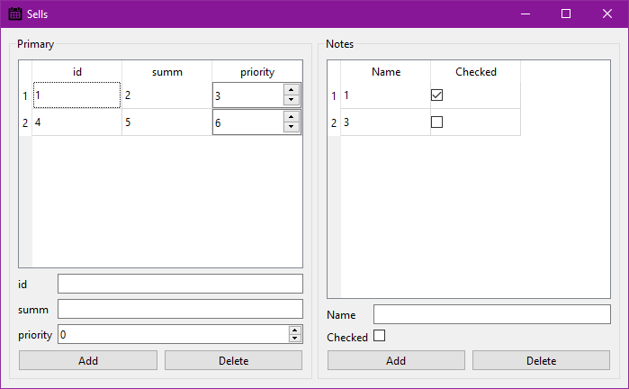

# MiniDbHelper

> Python module for quick building minimalistic interface for database.

[](https://opensource.org/licenses/MIT)

# Install

Just clone or download...

```
pip3 install -r requirements.txt
```

# Usage example

```Python
from MiniDbHelper.MiniDbHelper import MiniDbHelper, Layout
from PySide6.QtWidgets import QApplication
import sys

app = QApplication(sys.argv)

window = MiniDbHelper("Sells",
                      Layout(title="Primary",
                             fields={"id" : "int", "summ": "int", "priority": "short"},
                             initial_data=["1", "2", "3", "4", "5", "6"]),
                      Layout(title="Notes",
                             initial_data=["1", "2", "3", "0"],
                             fields={"Name": "", "Checked": "bool"}))

window.show()
sys.exit(app.exec())
```

### Result



# Input

```Python
data = {"Field Name": "type", "Another Field": "type"} #Dictionary
```

### Supported types:

- "str" -> (QLineEdit)
- "int" -> (QDoubleSpinBox) -> STORED AS FLOAT
- "unsigned" -> (QDoubleSpinBox) -> STORED AS FLOAT
- "bool" -> (QCheckBox)

+ not specified -> "str" -> (QLineEdit)

# on_add() & on_delete()

Optional methods to check/process data when user clicks add/delete button

```Python
def on_add(vals: list) -> list:
    new vals = edit(vals)

    return new_vals
```

Default: no action

# validator()

Optional method to control user input

```Python
def validator(vals: list) -> str:
    if some_error:
       return "Error text" #Show error text to user

    return "~OK" #Just continue
```

Default: just checks if all input fields are not empty.

# Terminology

+ vals - list of values of its native type (according to [supported types](#supported-types)): `[123.0, "String", True, -32.43]`

# TO-DO

- Окно должно быть готово к использованию сразу после создания экземпляра класса;
- Хранить словари элементов чтобы можно было обращаться к ключевым позициям для их модификации или независимого получения данных;
- Полностью адаптивный интерфейс. Либо через QDockWidget либо через разделители для изменения размелов;
- Импорт/Экспорт данных CSV/Excel/...;
- Возможность скрывать поля ввода для пользователя.
